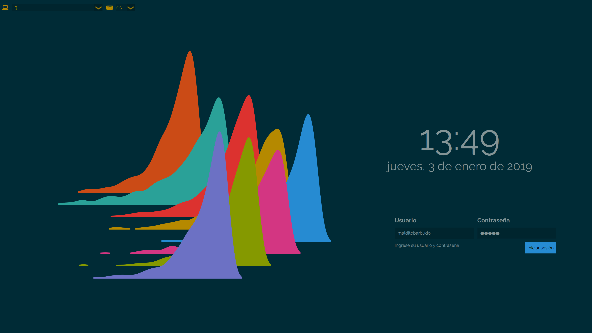

# Solarized theme for SDDM

This theme is a fork of [MalditoBarbudo/solarized\_sddm\_theme](https://github.com/MalditoBarbudo/solarized_sddm_theme).
The code is updated to support recent `SDDM` versions (tested with `0.21.0`).

It is initially inspired by the Numix SDDM theme
([https://github.com/intialonso/intialonso.github.io](https://github.com/intialonso/intialonso.github.io/tree/master/themes/sddm/numix))
by Inti Alonso and the default SDDM theme, Maui ([https://github.com/sddm/sddm](https://github.com/sddm/sddm)).

The wallpaper was created using [Inkscape](https://inkscape.org).
It also uses some icons from the Numix icon theme
([https://github.com/numixproject/numix-icon-theme](https://github.com/numixproject/numix-icon-theme))
(shutdown, warning, and down arrow icons).

QML files contain license headers.

## Aim

The aim of this theme is to display a simple yet complete `SDDM` greeter based on
the Solarized palette by Ethan Schoonover
([http://ethanschoonover.com/solarized](http://ethanschoonover.com/solarized)).

I use these colors almost everywhere, so why not in the greeter? ;)

## Installation

### Stable version

#### Arch Linux

The theme can be installed from the `solarized-sddm-theme`
[AUR package](https://aur.archlinux.org/packages/solarized-sddm-theme/). This
package contains the latest stable version.

#### Other Linux distributions

> This theme has only been tested on Arch Linux. It should work on other
> distributions like Fedora or Ubuntu, but use it at your own risk.

To install on other Linux distributions, you must get the latest stable version
from [GitHub](https://github.com/hcartiaux/solarized_sddm_theme/tags)
(`v0.2.0` at the time of writing):

```
# this command will download and untar the package
wget https://github.com/hcartiaux/solarized_sddm_theme/archive/refs/tags/v0.2.2.tar.gz -O - | tar xz
```

Then copy the created theme folder to `/usr/share/sddm/themes`.
Finally, don't forget to change the theme in `/etc/sddm.conf`.

## Fonts

This theme uses the `Raleway` font by default. If `Raleway` is not installed,
the default `SDDM` font is used. `Raleway` can be installed on Arch Linux from the AUR:

* [otf-raleway](https://aur.archlinux.org/packages/otf-raleway/)
* `Raleway` can also be installed from
  [ttf-google-fonts-git](https://aur.archlinux.org/packages/ttf-google-fonts-git/),
  which also installs other cool fonts.

#### Changing font in `theme.conf`:

If you want to try different fonts, use your favorite font, or just specify one
that is installed on your system, you can modify the `displayFont` field in the
`theme.conf` file (in the theme folder, usually `/usr/share/sddm/themes/solarized-sddm-theme/` if installed from AUR).
For example, to change to Montserrat font:

```
[General]
background=Backgrounds/background.png
displayFont="Montserrat"
```

But be careful, some fonts don't mix well with the theme.

## Screenshot (2019-01-03)



## Former backgrounds

With version 0.1.8 a new default background was introduced (`ridges`). If you
prefer the former backgrounds (`bars`, `circles` or `traces`) you can find them
in the theme folder as `bars_background.png`, `circles_background.png` and
`traces_background.png`.
To use any of them change the `theme.conf` file accordingly:

```
[General]
background=Backgrounds/bars_background.png
```
or

```
[General]
background=Backgrounds/circles_background.png
```

## License

The theme is licensed under the GPL.
QML files are MIT licensed.
